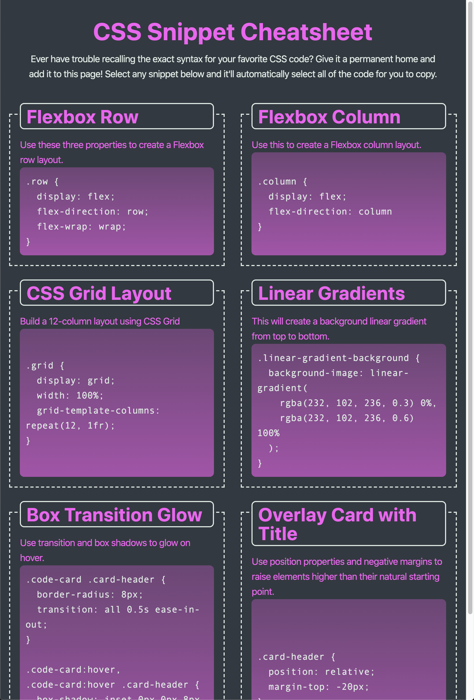

CSS Snippet Cheat Sheet
A webpage that will hold a collection of CSS snippets.

* Each CSS snippet should have a card-like layout with the CSS syntax wrapped in an [HTML pre element](https://developer.mozilla.org/en-US/docs/Web/HTML/Element/pre).

* Each CSS snippet can easily be highlighted for copying on click using the [CSS user-select property](https://developer.mozilla.org/en-US/docs/Web/CSS/user-select).

  * At size 992px and above, the app should resemble the following image:

    

  * At size 768px and above, the app should resemble the following image:

    

  * On mobile devices, anything under 768px, the app should resemble the following image:

    
